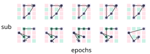
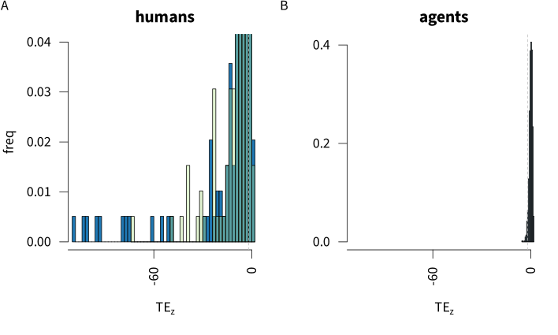
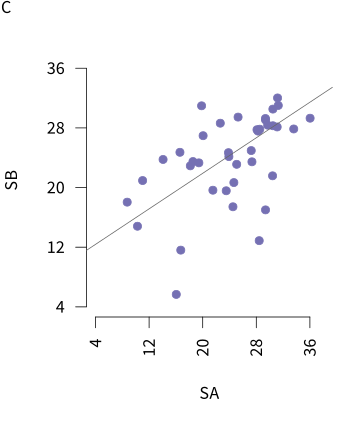
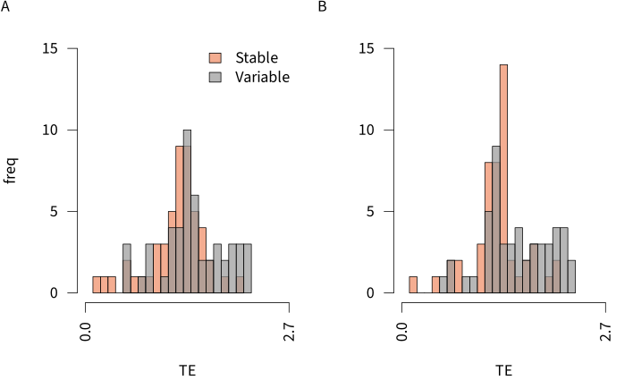
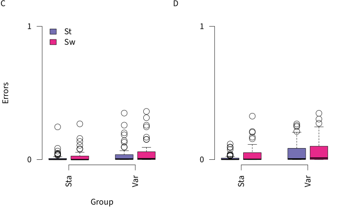
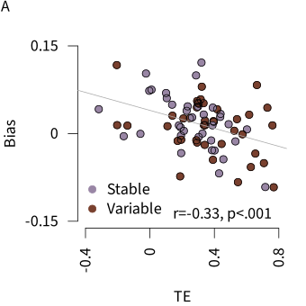

## Produce the results for 'Towards the definition and measurement of routines and their impact on cognitive control'

This notebook provides a computationally reproducible record of the analysis and figure generation for the paper 'Towards a normative theory of routines' (or whatever we wind up deciding to call it).

### Settings and other things

This notebook assumes you have the following file structure. Note that the pre-existing csv files were generated by the code in [this repository.](https://github.com/garner-code/doors), and the .Rda file was generated in the previous dopamine study using code in [this repository](https://github.com/garner-code/DA_VisRoutes).

``` markdown
routines_produce-results/
│   ├── _quarto.yml
│   ├── *.Rproj
│   ├── this-qmd-doc.qmd
│   ├── R/
│   │   └── all-r-scripts.R
│   ├── data-wrangled/
│   │   └── exp_[exp_str]_evt.csv
│   │   └── exp_[exp_str]_avg.csv
│   │   └── exp_lt_maggi-k4.csv
│   │   └── dat4_seq_model.Rda ### need to find origin of this file and make consistent across locations
│   ├── figs/
│   ├── sims/
│   ├── res/
│   ├── analysis-output/
```

First, load required packages and set the relative paths for data and other required things...

```{r, fold=TRUE, message=FALSE, results='hide'}
options(tidyverse.quiet = TRUE)
library(tidyverse)
library(grid)
library(gridExtra)
library(knitr)
library(magick)
library(ggpubr)
library(vioplot)
library(rstatix)
library(emmeans)
library(afex)
library(pdftools)
library(purrr)
library(GGally)
library(interactions)

data_path = 'data-wrangled/' # for all data derivs
sim_data_path = 'sims/' # for simulation results
fig_path = 'figs/' # for figures
res_path = 'res/' # for inferential results

function_loc <- "R" # where are the functions?
req_functions <- list.files(function_loc)
sapply(req_functions, function(x) source(paste(here::here(function_loc),x, sep="/")))

# # now some font settings
library(extrafont)
#font_import() # run this once only, comment out after first time
loadfonts(device='pdf')
fig_font <- grep("source", fonts(), value = TRUE, ignore.case = TRUE)

# the below are relevant to the z-score plot but are also the base for many other plot dims and colour schemes so will put these here
z_p_wdth <- 10 # plot width of ms plot, in cm
z_p_hgt <- z_p_wdth*(6/10)
col_scheme <- c('#1b9e77','#d95f02', '#7570b3')
```

## Q1. Can we produce routines in a consistent way across sessions and conditions?

Here, I calculate the routine (R) scores for each participant, generate density plots of those scores over experiments and conditions, and then I print out the analysis of the basis differences between conditions, across replications.

### Compute TE Scores


First I compute TE scores for each participant. Note that these shall be sometimes referred to as R scores within this document.

First I compute TE scores for each participant, using the formula -

{width="390"}


```{r, fold=TRUE, results='hide'}

apply_sort_data <- function(exp_str, data_path){
    # take the trial level data from session 2 and sort into contexts. We assume a person believes they are in the same context until their first 'cc' hit after a context switch.
  data_fname <- paste(data_path, 'exp_', exp_str,
                       '_evt.csv', sep='')
  save_fname <- paste(data_path, 'exp_', exp_str,
                          '_door_selections_for_ent.csv', sep='')
  ent_initial_data_sort(data_fname, save_fname)
}
lapply(c('lt', 'ts'), apply_sort_data, data_path=data_path)

apply_compute_R <- function(exp_str){
# take the data output from the step above, and compute the routine score for each participant and context
  data_fname <- paste(data_path, 'exp_', exp_str,
                      '_door_selections_for_ent.csv', sep='')
  save_new_data_fname <- paste(data_path, 'exp_', exp_str,
                               '_rscore-full.csv', sep='') # for saving R scores not averaged across context. Note that original plotting code in the function below, now commented out, shows that
  save_sum_data_fname <- paste(data_path, 'exp_', exp_str,
                               '_rscore.csv', sep='')
  ent_compute_routine_measure(data_fname, save_new_data_fname, save_sum_data_fname)
}

lapply(c('lt', 'ts'), apply_compute_R)
```

Now that we have the R scores, we can investigate whether we elicit R scores that are greater than you would expect by chance, measure something reliable in humans, and we want to get a feel for what the behaviour is that we are quantifying.

I will make 3 subplots: one showing the z-scores for humans vs agents, one showing the reliability of the measure over sessions, and one showing the trajectories for 2 participants. These will then be put together into one big figure, for the manuscript

### Trajectories

Note that the below 'function' contains hard coded, handpicked subsets of trials, to show the trajectories in performance.

```{r, results='hide', output=FALSE}

exp_str <- 'lt'
traj_data_fname <- paste(data_path, 'exp_', exp_str, '_evt.csv', sep="")
traj_fig_fname <- paste(fig_path, 'trajectories', sep='')
w <- 10 # width of plot, in cm
traj_plt <- plot_trajectories(traj_data_fname, traj_fig_fname, w, fig_font)


```

Now we've created it, lets display it -

::: {#fig-trajectories layout-ncol="1"}


Fig 1: example trajectories across doors
:::

### R scores are systematically higher than you would expect by chance

The next thing we want to demonstrate is the R scores are statistically higher than you would expect by chance. To achieve this, we first generate a null distribution of door selections for each subject, and obtaining a z score for their observed R score and the mean and sd of the null. We will compare this to zero, and to the performance of a perfectly performing, random agent.

First, to make the nulls, we take their observed data, and resample it a thousand times, under the constraint that the same door can't be sampled twice.

Note that the evaluation of the code block below is set to false, as it takes a while to get the null distributions

```{r, eval=FALSE}

set.seed(42) # for reproducibility is the meaning of life
exp_strs = c('lt', 'ts')

apply_generate_nulls <- function(exp_str){
  door_selections_fname = paste(data_path, 'exp_', exp_str, '_door_selections_for_ent.csv', sep='')
  r_dat_fname = paste(data_path, 'exp_', exp_str, '_rscore-full.csv', sep='')
  null_rs_fname = paste(data_path, 'exp_', exp_str, '_rnulls.csv', sep='') # for saving
  generate_nulls(door_selections_fname,
                 r_dat_fname,
                 null_rs_fname)
}
lapply(exp_strs, apply_generate_nulls)

```

Now that we have the null Rs, we can compute a z-score for each participant, based on their observed R, and the null distribution. We will save the z-scores for plotting, and save the results of t-tests against zero and against -2 to a csv file. Note that when the below was originally run, visual inspection of the data showed some outliers, so I removed participants with a z-score \> or \< 3 standard deviations from the mean.

```{r, results='hide'}

exp_strs <- c('lt','ts')

z_comps <- function(exp_str, data_path){
  null_rs_fname = paste(data_path, 'exp_', exp_str, '_rnulls.csv', sep='') # for saving
  zs_out_fname = paste(data_path, 'exp_', exp_str, '_zs_cl.csv', sep='')
  zs_stats_fname = paste(res_path, 'exp_', exp_str, '_zs_cl_inf-test.csv', sep='')
  ent_compute_zs(null_rs_fname, zs_out_fname, zs_stats_fname)
}  

lapply(exp_strs, z_comps, data_path=data_path)
  
```

Lets look at those stats!

```{r}

z_stats <- do.call(rbind, lapply(c('lt', 'ts'), 
                function(x) read.csv(paste(res_path, 'exp_', x, '_zs_cl_inf-test.csv', sep=''), 
                                     header=T)))


#| label: distribution of z scores (routine score against permuted null)
#| tbl-cap: "distribution of z scores (routine score against permuted null)"
kable(z_stats %>% select(!data.name), digits=2)

```

Now we want to visualise the z-scores, but we will also compare them to the performance of a perfectly performing but perfectly random agent, whose choices are similar constrained like the participant nulls (i.e. the same door cannot be picked twice in a row).

Note that the below code block does not run, owing to the comp time required to generate the nulls.

```{r, eval=FALSE}

agent_save_name <- paste(sim_data_path, 'random-agent_z-score-analysis.Rds', sep='')
get_random_agent_null(n_samples=1000, save_name = agent_save_name)
```

Now lets plot the histograms of humans vs random agent. Note this code produces a labelled pdf (humans v agent) for talks, and a pdf pared back for a manuscript.

```{r}

exp_strs <- c('lt', 'ts')
z_col_scheme <- c('#1f78b4', '#b2df8a', '#a6cee3')
names(z_col_scheme) <- c(exp_strs, "agent")
sims_fname = paste(sim_data_path, 'random-agent_z-score-analysis.Rds', sep='/')
ms_z_plt_fname = paste(fig_path, 'z-hsts_ms', sep='')
tlk_z_plt_fname = paste(fig_path, 'z-hsts_tlk', sep='')

produce_z_plts(exp_strs,
               z_col_scheme,
               z_p_wdth,
               z_p_hgt,
               data_path,
               sims_fname,
               ms_z_plt_fname,
               tlk_z_plt_fname,
               fig_font)
```

{fig-align="cent"}

Next, we can compare the mean z-score of the humans to that of the random agent - i.e. what is the probability that the mean z-score of the humans comes from the null distribution of the random agent?

```{r}

exp_strs <- c('lt', 'ts')
human_zs <- lapply(exp_strs, function(x) read.csv(paste(data_path,
                                                        'exp_', x,
                                                        '_zs_cl.csv', 
                                                        sep=''), header=T))

# this will load a n length vector called 'zs' where n = the number of times a null was generated for the random agent
load(paste(sim_data_path, 'random-agent_z-score-analysis.Rds', sep=''))

human_v_agent_zs <- sapply(human_zs, function(x) (mean(x[,'mu_z']) - mean(zs))/sd(zs))
names(human_v_agent_zs) <- exp_strs
human_v_agent_ps <- sapply(human_v_agent_zs, pnorm)
names(human_v_agent_ps) <- exp_strs

# make a dataframe of the results and save as a csv
hum_z_dat <- tibble(exp = exp_strs,
                    mu = c(round(mean(zs),2), NA),
                    sd = c(round(sd(zs),2), NA),
                    zs = human_v_agent_zs,
                    ps = human_v_agent_ps)
# this needs to be rounded to 2 dp.
hum_z_dat[,c("zs", "ps")] <- apply(hum_z_dat[,c("zs", "ps")], 2, round, 2)
write.csv(hum_z_dat, file=paste(res_path, 'human_v_agent_zs.csv', sep=''),
          row.names=FALSE)

# print out the result
sprintf('the probability that the human data comes from the null distribution is p= %.2f for the lt exp, and p= %.2f for the ts exp', round(human_v_agent_ps['lt'],2), round(human_v_agent_ps['ts'],2))


```

### Routine scores are reliable across sessions

Now that we know we elicit routines above what you would expect by chance, we next ask, using the data from the dopamine study, how reliable are these routines within an individual?

```{r, eval=FALSE, results='hide'}

rel_data_fname <- paste(data_path, 'dat4_seq_model.Rda', sep='') # note: this datafile was generated by this project -https://github.com/garner-code/DA_VisRoutes and copied over to this project for the current analysis 
rel_data_save_name <- paste(data_path, 'rel_rs_wf.csv', sep='') # save the r's from da and placebo in widefrom
rel_analysis_save_name <- paste(res_path, 'da_reliability_analysis.csv', sep='')
reliability_analysis(rel_data_fname, rel_data_save_name,
                     rel_analysis_save_name)

# now we've made the data file, report the results of the reliability analysis
rel <- read.csv(rel_analysis_save_name)
fmt = 'the %s measure demonstrates some reliability, r = %.2f, 95 CI[%.2f, %.2f], t(%.0f) = %.2f, p = %.2f'
sprintf(fmt, rel$measure, rel$r, rel$l, rel$u, rel$df, rel$t, rel$p)
```

Now let's see the correlation in the data -

```{r, eval=FALSE}

# note the 'r' is for reliability
r_p_wdth <- z_p_wdth/2 # plot width of ms plot, in cm - its half the width of the z-score plot
r_p_hgt <- z_p_hgt
r_col = col_scheme[3]
fig_lab = 'C'
rel_data_save_name = rel_data_save_name
rel_plt_fname = paste(fig_path, 'reliability_data', sep='')
plot_rel(r_p_wdth, r_p_hgt, r_col,
         fig_lab, 
         rel_data_save_name,
         rel_plt_fname,
         fig_font=fig_font)
```

{fig-align="cent"}

Now I can put Figs 1, 2 together to make one figure. (3 is for refs, not for the manuscript). Going to use the magick package, as dealing with pdfs.

```{r, eval=FALSE}


fnms = c(traj_fig_fname, ms_z_plt_fname)

ims = lapply(fnms, function(x) image_read_pdf(paste(x, '.pdf', sep='')))

multi <- image_append(c(ims[[2]], ims[[1]]), stack = TRUE)

pdf(paste(fig_path, 'FigA.pdf', sep='')) #, width=z_p_wdth+r_p_wdth,
   # height=z_p_hgt+traj_hght)
plot(multi)
dev.off()

```

## Can we systematically manipulate how routine someone is?

Now we want to demonstrate that over our two experiments, our training manipulation of stable vs less stable contexts make people more or less routine. We then want to locate the source of disruption to the routine (i.e. what kind of responses are different between the two groups)

### How did the training manipulation affect routine scores over the two experiments?

To answer this, we need to visualise the routine scores by training group, across the two experiments.

```{r, results='hide'}
# first, I need to get the routine scores matched with the training group scores
lapply(c('lt', 'ts'), get_r_info_and_save, data_path=data_path)
col_scheme = c("#ef8a62","#999999")
plot_r_train(x="TE",
             p_wdth = z_p_wdth, 
             p_hgt = z_p_hgt, 
             breaks = 15,
             cols = col_scheme, 
             x_rng = c(0, 2.7),
             y_rng = c(0, 15),
             exp_strs = exp_strs,
             data_path = data_path,
             r_by_g_fname = paste(fig_path, 'rs_by-traintype_hists', sep=''),
             fig_font=fig_font)

```

{fig-align="cent"}

As predicted, there is a systematic difference between training conditions. Now we can test the difference between them. Note that as the scores are clearly skewed, we will log transform the r scores prior to performing a t-test to compare the two groups in each experiment.

```{r, results='hide'}

get_rdat_and_label <- function(exp_str, data_path){
  rdat <- get_dat(exp_str, data_path)
  rdat$exp = exp_str
  rdat
}

rdat <- do.call(rbind, lapply(exp_strs, get_rdat_and_label, data_path = data_path))

do_grp_t <- function(rdat, exp_str){
  with(rdat %>% filter(exp == exp_str),
       t.test(log(TE) ~ train_type))
}

get_cohens <- function(rdat, exp_str){
  tmp = rdat %>% filter(exp == exp_str) %>%
          mutate(log_TE = log(TE))
  cohens_d(data = tmp,
           formula = log_TE~train_type,
           ci = TRUE,
           ci.type="perc",
           nboot = 1000)
}

grp_comps <- lapply(exp_strs, do_grp_t, rdat=rdat)
grp_cohens <- lapply(exp_strs, get_cohens, rdat=rdat)

prnt_t <- function(t_res, d_res){
  
  tibble(t = abs(round(t_res$statistic, 2)),
         df = round(t_res$parameter, 2),
         p = round(t_res$p.value, 3),
         mu_diff = round(t_res$estimate[1] - t_res$estimate[2], 2),
         mu_l = round(t_res$conf.int[1], 2),
         mu_u = round(t_res$conf.int[2], 2),
         d = abs(round(d_res$effsize, 2)),
         d_l = abs(round(d_res$conf.low, 2)),
         d_u = abs(round(d_res$conf.high, 2)),
         dv = 'log r')
}

grp_r_comp <- do.call(rbind, 
                      lapply(1:length(grp_comps),
                             function(x) 
                               prnt_t(grp_comps[[x]],
                                      grp_cohens[[x]])))
grp_r_comp$exp <- exp_strs

# now save as a csv file 
write.csv(grp_r_comp, paste(res_path, 'grp_r_ts.csv', sep=''), row.names=FALSE)

```

Now I need some descriptive statistics

```{r}

rdat_desc <- rdat %>% group_by(exp, train_type) %>%
  summarise(M=mean(TE),
            SD=sd(TE),
            N=length(TE),
            SE=SD/sqrt(N))
cols2rnd <- c("M", "SE")
rdat_desc[cols2rnd] <- apply(rdat_desc[cols2rnd], 2, round, 2)
rdat_desc$id = paste(rdat_desc$exp, rdat_desc$train_type, sep="_")

write.csv(rdat_desc, paste(res_path, 'grp_r_desc-stats.csv', sep=''), row.names=FALSE)
```

The results are pleasingly consistent across both experiments, so will show the inferential outcomes in a table -

```{r}
#| label: routine by group tests
#| tbl-cap: "comparing routines by groups"

kable(grp_r_comp, digits=2)

```

### What kinds of responses account for the differences in routine observed between the groups, across the two experiments?

This is where we look at the task-jumps measure between the two groups. Here I create a group x trial type dataframe and draw and save the boxplots. Note that this data is reported in Barnes et al (2026), and is not presented in the current project.

```{r, results='hide'}

# first, get the task jump data - note that I am not saving it as a csv,
# as it already exists with all the relevant info in the _avg csv
get_jump_data <- function(exp_str, data_path){
  
  tmp <- read.csv(paste(data_path, 'exp_', exp_str,
                        '_avg.csv', sep='')) %>%
    filter(ses == 2) %>%
    select(sub, train_type, context, switch, context_changes) %>%
    group_by(sub, train_type, switch) %>% 
    summarise(jumps=mean(context_changes)) %>%
    ungroup()
  tmp$exp = exp_str
  tmp
}

jumps <- do.call(rbind, lapply(exp_strs, get_jump_data,
                               data_path = data_path))

j_wdth = z_p_wdth
j_hgt = z_p_hgt
col_scheme = c('#7570b3', '#e7298a')

gen_jumps_plot(jumps,
               'jumps ~ switch*train_type', 
               exp_strs,
               col_scheme,
               j_wdth, j_hgt,
               paste(fig_path, 'task-jumps', sep=''),
               fig_labs = c('A', 'B'),
               ylabel = 'Jumps',
               xlabel = 'Group',
               ylims=c(0,5),
               fig_font)

```

We can conclude at this point that frequent switching makes people more variable in the order in which they perform their behaviours, and that this might be because they are jumping between the two tasks more frequently. This may be because they are mixing up the two tasks more. We also want to rule out general confusion. To do this, we look at responses that come from neither task. Note, this figure can go in the supplemental info.

```{r}

# get general errors data
get_error_data <- function(exp_str, data_path){
  
  tmp <- read.csv(paste(data_path, 'exp_', exp_str,
                        '_avg.csv', sep='')) %>%
    filter(ses == 2) %>%
    select(sub, train_type, context, switch, general_errors) %>%
    group_by(sub, train_type, switch) %>% 
    summarise(errors=mean(general_errors)) %>%
    ungroup()
  tmp$exp = exp_str
  tmp
}

errors <- do.call(rbind, lapply(exp_strs, get_error_data,
                                data_path = data_path))

gen_jumps_plot(errors,
               'errors ~ switch*train_type',
               exp_strs,
               col_scheme,
               j_wdth, j_hgt,
               paste(fig_path, 'general-errors', sep=''),
               fig_labs = c('C', 'D'),
               ylabel = 'Errors',
               ylims=c(0,1),
               xlabel = 'Group',
               fig_font)
```

{fig-align="cent"}

So being in the variable group impacts your routines. The next question is why?

## Why did the stable vs variable manipulation impact routines?

The key thing we want to know is, did we mess up people's routines because they were probability matching to context, instead of tracking the probability of success, given the context?

Using Bayes theorem, we compute the probability that you are still in context A, given that you have observed that n number of doors from A, and m number of doors from B do not have a target behind them. We can use this probability to then compute the probability of success on your next go, given the number of doors left in each context.

Using Bayes theorem, we can cast the probability that you are still in $C_A$, given you have observed n and m false doors:

$$P(C = A | n, m) = \frac{ P(n,m|C=A)P(C=A)}{P(n,m)}$$

Once we have the probability of being in that context, given n and m, we can compute the probability of success for staying in that context, and the probability of success for moving to the other context, by taking the new probability of still being in context A, and multiplying it by the probability of success, given the number of doors left in A.

$$P(S|C = A,n) = \frac{P(C=A|n,m)}{n_\mathrm{max} - n}$$

where S is success, and $n_{\mathrm{max}}$ is the total number of n that can be chosen (i.e. the number of target doors in the set).

Note that we ignore repetitions when calculating these trial by trial probabilities.

We want to see how well each set of probabilities accounts for task jumps, over and above what can be accounted for by the number of switches a participant experiences (i.e. with increasing switches comes increasing chance of confusion), or the switch rate (how often a switch occurs on average, given experience).

Switches are the cumulative sum of experienced switches - i.e. how often you found a target in a context that is different to the last context where you found a target:

$$\mathrm{Sw} = \sum_{i=1}^S S(i)$$

And switch rate is simply the probability of a switch, given the number of targets you have found:

$$\mathrm{Sw_{r}} = \frac{\mathrm{Sw}}{t}$$

where t is the total number of targets found so far.

First lets get the data in shape. First we get the switch and switch rate variables -

```{r, eval=FALSE}

exp_strs <- exp_strs

get_sw_info <- function(exp_str){
  dat <- read.csv(paste(data_path, 'exp_', exp_str, '_evt.csv', sep='')) %>%
      filter(ses == 2) %>% 
      select(sub, train_type, t, context, door, door_cc, door_oc, door_nc, switch)

      #################################################
      # add Sw and Swr regressors for each subject
      subs <- unique(dat$sub)
      dat <- do.call(rbind, lapply(subs, get_Sw, dat=dat))
      dat$exp = exp_str
      dat
}

dat <- do.call(rbind, lapply(exp_strs, get_sw_info))
```

Now I will get $p(C = A | n, m)$ and $p(S|C,n)$. The function I call is a bit of a beast, but hopefully its sufficiently commented that its easy enough to follow what is happening. Basically for each trial, I calculate:

$p(C = A) = \frac{1}{t} \sum_{i=1}^{t} (C_i == C_{i-1})$

For each trial, I then count the number of n's and m's. Note that n and m are characterised according to the last place you found a target. e.g. if I just found a target from CA, but the true state of the world is now CB, any selection from CB would be counted as an m, as I have no evidence yet to tell me its an n. Note that each n and m is only counted once (duplicates are not counted).

For the cumulative counts of n and m on each trial, I assign the probability of that many nulls, given you are in the context to which those doors belong. Note the equation below is defined for n, but I also do the same for $p(m|C=B)$

$$p(n | C=A) =  \frac{n_{max} - n}{n_{max}}$$

This allows me to compute, based on trial by trial experience, $p(C = A | n, m)$ and $p(S|C=A, n,m)$. At the end, I then shift all the information down 1 row, as the current outcome should affect the next behaviour. For each regressor, I then take the odds by dividing by $p(C=B|n,m)$ and $p(S|C = B,n,m)$.

```{r, eval=FALSE}

exp_strs <- exp_strs

get_pcanm_info <- function(exp_str, dat){
  #################################################
  # add Sw and Swr regressors for each subject
  subs <- unique(dat$sub)
  dat <- do.call(rbind, lapply(subs, get_p_context, dat=dat))
  dat
}

dat <- do.call(rbind, lapply(exp_strs, function(x) get_pcanm_info(x, dat %>% filter(exp == x))))
write.csv(dat, paste(data_path, 'evt-dat_4log-reg.csv', sep=''), row.names=FALSE)
rm(dat)
```

Now I have the model-based regressors, I use them in a hierarchical logistic regression to predict $m$ selections for each individual. Note that I scale the predictors before running the model. See the following files for details of that analysis:

``` markdown

routines_produce-results/
│ model-choices.R
| model-plots.R
| model-results.R
| plot_glmm_res.R
```

## Does the formation of routines attenuate capacity to transfer learning, or promote task switching performance?

Now the cherry on top. We ask whether the extent to which you became routine (the lower your r score) predicts your difficulty being flexible on a novel task.

### Learning transfer/flexibility

First steps are to wrangle the routine and group x transfer task data, and looking at difference between identity and mixed for each group and task as a boxplot. Note that from visual inspection of qqplots, I decided to log transform the data, to improve normality. Then I take the ratio of the scores from each task and regress against task jumps and TE from the training phase.

```{r}

# wrangle data
r_dat <- read.csv(paste(data_path, 'exp_lt_rscore.csv', sep=''))
onset_dat <- read.csv(paste(data_path, 'exp_lt_maggi-k4.csv', sep='')) %>% 
  select(sid, ses, transfer, k4_onset) %>% 
  filter(ses == 3) %>%
  mutate(transfer=recode(transfer, `1` = 'comp', `2` = 'part')) %>%
  pivot_wider(names_from=transfer, values_from=k4_onset) %>% 
  mutate(k4 = (comp - part)/(comp+part),
         k4_diff = comp - part)
# of all the time you spent learning, what proportion of that time was spent learning
# each task?
# the closer to +1, the more time you spent learning the comp relative to partial,
# the closer to -1, the more time you spent learning the partial relative to the comp
names(onset_dat)[names(onset_dat) == "sid"] = "sub"
# proportion makes it more normal

# some participants never learned, so we lose anyone who has a k4 of NaN,
# as that means their score was Inf
onset_dat <- onset_dat %>% 
                mutate(comp=ifelse(is.finite(comp), comp, NA), 
                       part=ifelse(is.finite(part), part, NA),
                       k4=ifelse(is.finite(k4), k4, NA))

# now join to the r dat
onset_dat <- inner_join(onset_dat, r_dat, by='sub')

# get group info and the accuracy difference
tmp = read.csv(paste(data_path, 'exp_lt_avg.csv', sep='')) %>% 
  filter(ses == 3) %>%
  mutate(transfer=recode(transfer, `1` = 'comp', `2` = 'part')) %>%
  group_by(sub, train_type) %>%
  summarise(acc_diff = accuracy[transfer=='comp'] - accuracy[transfer=='part'])
# accuracy: comp > part = positive bias score (part = harder)
# the lower your TE, the higher your bias score.
onset_dat <- inner_join(onset_dat, tmp, by = 'sub')
rm(tmp)
# now I log my variables, and I load the avg data so that I can get the training 
# group variale
onset_dat <- onset_dat %>% mutate(log_TE = log(TE)) # add a small constant to get rid of zeros
dvs <- c('k4', 'log_TE', 'TE', 'acc_diff')
onset_dat <- cbind(onset_dat,
                   do.call(cbind, lapply(dvs, remove_outliers, betas=onset_dat)))

rem <- do.call(cbind, lapply(onset_dat, function(x) sum(is.na(x))))
rem <- rem[colnames(rem) %in% c("k4_flt", "log_r_flt", "acc_diff_flt")]

write.csv(rem, paste(res_path, 'exp_lt_k4_r_outs-rem.csv', sep=''), row.names = FALSE)
write.csv(onset_dat, paste(data_path, 'exp_lt_onsetwr.csv', sep=''), row.names=FALSE)
```

```{r}

# run the correlation analyses
transfer_mod_dat <- onset_dat
acc_diff_test <- tidy(with(onset_dat, cor.test(acc_diff, log_TE_flt)))
k4_diff_test <- tidy(with(onset_dat, cor.test(k4, log_TE_flt))) 
# turn correlation test into dataframes and save
cor_res <- rbind(acc_diff_test, k4_diff_test)
names(cor_res) <- c("r", "t", "p", "df", "l", "h", "method", "tails")
cor_res[, c("r", "t", "p", "l", "h")] <- apply(cor_res[, c("r", "t", "p", "l", "h")], 2, round, 2)
cor_res$id <- c('acc_diff', 'onset_diff')
write.csv(cor_res, paste(res_path, 'TE_transfer_corrs.csv', sep=''), row.names=FALSE)
print(cor_res)
```

```{r}

#now make correlation plot between acc_diff and log TE

# some plot settings
bs_wdth = 6
bs_hgt = 6

lt_bias_corr_fname = paste(fig_path, 'lt-bias_r_corr', sep='')

plt_r_bias_cor_4paper_andtlks(plt_sv_nm=lt_bias_corr_fname,
                              p_wdth=bs_wdth, p_hgt=bs_hgt,
                              fig_lab='A',
                              fig_font=fig_font,
                              x=transfer_mod_dat$log_TE_flt, 
                              y=transfer_mod_dat$acc_diff_flt,
                              grp=transfer_mod_dat$train_type,
                              xlabel="TE",
                              ylabel="Bias",
                              x_seq = round(seq(-0.4, 1, 0.4),2),
                              y_seq = round(seq(-0.15, 0.15, 0.15),2),
                              cor_text="r=-0.33, p<.001",
                              xtext = 0.45,
                              ytext = -0.14)
```

{fig-align="cent"}
